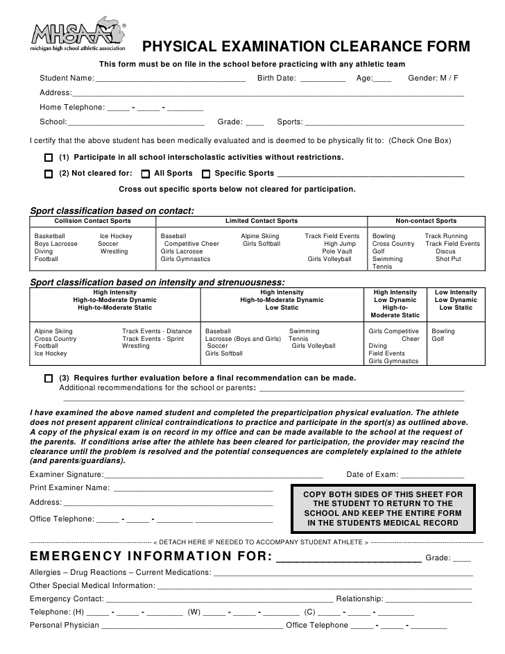
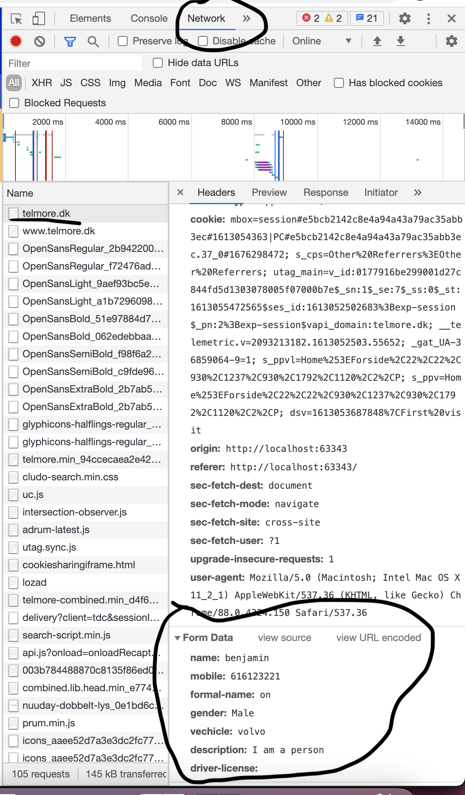

# Forms, post and redirect

## Overview

- HTML forms
- `@PostMapping`
- `forward`, `redirect`
- PRG pattern


**Why are we even talking about forms and post?**

Sending data to a server is essential for interacting with a website user. Create a new user, booking online flight tickets, ordering a product online. 


## HTML Forms

HTML forms is used for sending data to the server. it comes from physical forms like these:





### Creating a form

Here is an example of a form

```html
<form action="https://telmore.dk" method="GET">
    <label for="name">Write your name</label>
    <input type="text" name="name" id="name" />

    <label for="mobile">Write your mobile</label>
    <input type="tel" name="mobile" id="mobile" />

    <label for="formal-name">Use formal name</label>
    <input type="checkbox" name="formal-name" id="formal-name"/>

    <label for="gender">Gender</label>
    <input type="radio" name="gender" id="gender" value="Female"/>
    <input type="radio" name="gender" value="Male" />
    <input type="radio" name="gender" value="Other" />

    <label for="vechicle">Select your favorite car brand</label>
    <select name="vechicle" id="vechicle">
        <option value="volvo">Volvo</option>
        <option value="fiat">Fiat</option>
        <option value="bmw">Bmw</option>
    </select>

    <label for="description">Describe yourself</label>
    <textarea name="description" cols="30" rows="3" id="description"></textarea>

    <label for="driver-license">Image of driver license</label>
    <input type="file" name="driver-license" id="driver-license"/>
    <button type="submit">Submit</button>
</form>
```

There are a few things going on. Lets disect it:

`action="https://telmore.dk"` - The `action` attribute decides what url the form data should be send to. 

`method="GET"` - The `method` attribute decides what kind of request to make. When posting we will mostly be using a `POST` request. Here is quickly about the two most important request types (there are a lot more but that's not relevant for now)

- **GET request** - Getting information. Fx get all the information we have on the user with id 1. Or simply get the html at the `/about` url. 
- **POST request** - Creating new information. Fx creating a new user, making a new order, creating new facebook post. 

`<label for="gender">Gender</label>` This is a label that is connected to some field (`input`, `textarea` or `select`). It helps the user figuring out what to put into the connected field. The connection between `label` and field happens with the `for` attribute and the `id` on the field. 

`type="text"` -  `input` fields can have a type. There are quite a lot of types. it can help the user and also do a bit of validation on the frontend. So fx if you specify `type="number"` then the number keyboard will come up on the users mobile. 

` name="description"` - When we send the data to a server, then name decides the key of that field. See below. Here is the `POST` request 




` button type="submit"` - When the button is clicked submit the form. 


## PostMapping

Now we have figured out how to send the `POST` request (with data) to the server using forms. Now we need to figure out how to get that data in our `@controller`

```java
@PostMapping(value = "/sign-up")
@ResponseBody
public String createNewUser(@RequestParam("name") String name, @RequestParam("age") int age) {
    return "User created with name: " + name + " and age: " + age;
}
```

using the `@PostMapping` notation we can use it just like the `@GetMapping` specifying a `value` that will be the endpoint. 


To get data out of the `POST` request use  `@RequestParam("name") String name`. `@RequestParam` specifies the key  you are looking for. Remember that the `name` attribute on the field decided the key!


