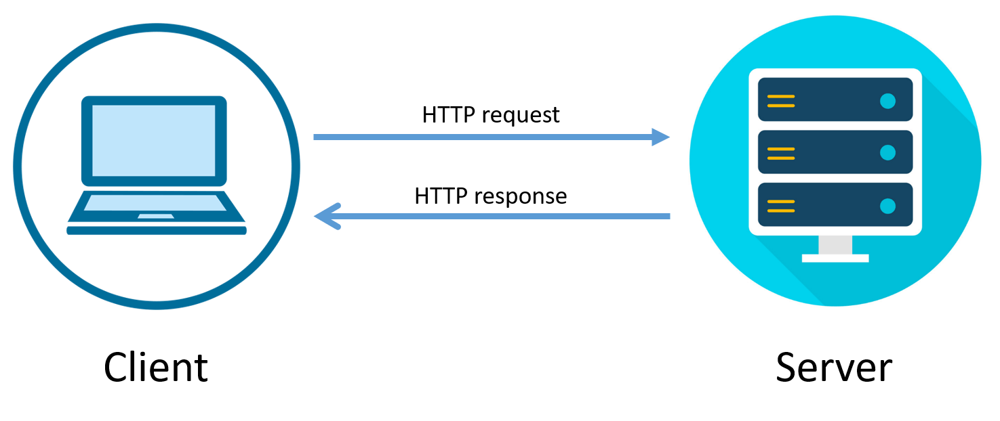
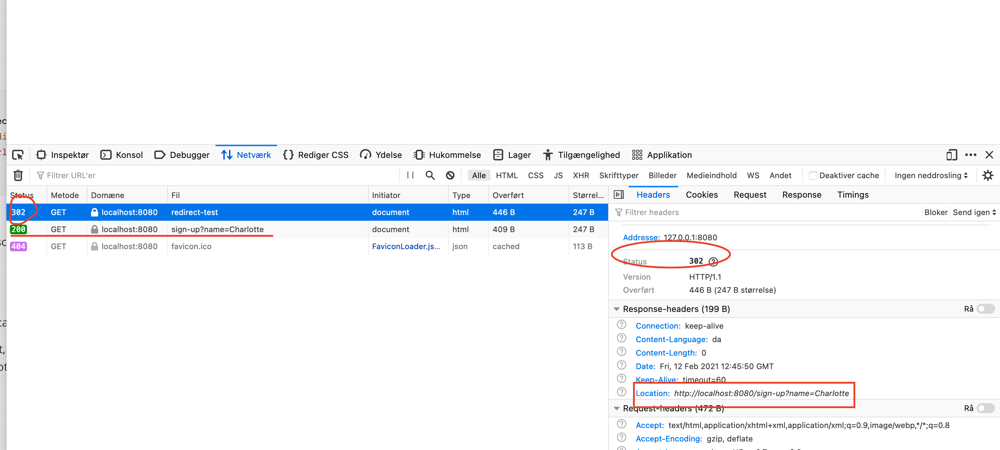

# Forms, post and redirect


## Overview

- HTML forms
- `@PostMapping`
- `forward`, `redirect`
- PRG pattern
- Exercise


**Why are we even talking about forms and post?**

Sending data to a server is essential for interacting with a website user. Create a new user, booking online flight tickets, ordering a product online. 


## HTML Forms

HTML forms is used for sending data to the server. it comes from physical forms like these:


### Creating a form

Here is an example of a form

```html
<form action="/sign-up" method="POST">
    <label for="name">Write your name</label>
    <input type="text" name="name" id="name" />

    <label for="mobile">Write your mobile</label>
    <input type="tel" name="mobile" id="mobile" />

    <label for="formal-name">Use formal name</label>
    <input type="checkbox" name="formal-name" id="formal-name"/>

    <label for="gender">Gender</label>
    <input type="radio" name="gender" id="gender" value="Female"/>
    <input type="radio" name="gender" value="Male" />
    <input type="radio" name="gender" value="Other" />

    <label for="vechicle">Select your favorite car brand</label>
    <select name="vechicle" id="vechicle">
        <option value="volvo">Volvo</option>
        <option value="fiat">Fiat</option>
        <option value="bmw">Bmw</option>
    </select>

    <label for="description">Describe yourself</label>
    <textarea name="description" cols="30" rows="3" id="description"></textarea>

    <label for="driver-license">Image of driver license</label>
    <input type="file" name="driver-license" id="driver-license"/>
    <button type="submit">Submit</button>
</form>
```

There are a few things going on. Lets disect it:

`action="https://telmore.dk"` - The `action` attribute decides what url the form data should be send to. 

`method="GET"` - The `method` attribute decides what kind of request to make. When posting we will mostly be using a `POST` request. Here is quickly about the two most important request types (there are a lot more but that's not relevant for now)

- **GET request** - Getting information. Fx get all the information we have on the user with id 1. Or simply get the html at the `/about` url. 
- **POST request** - Creating new information. Fx creating a new user, making a new order, creating new facebook post. 

`<label for="gender">Gender</label>` This is a label that is connected to some field (`input`, `textarea` or `select`). It helps the user figuring out what to put into the connected field. The connection between `label` and field happens with the `for` attribute and the `id` on the field. 

`type="text"` -  `input` fields can have a type. There are quite a lot of [types](https://www.w3schools.com/html/html_form_input_types.asp). it can help the user and also do a bit of validation on the frontend. So fx if you specify `type="number"` then the number keyboard will come up on the users mobile. 

` name="description"` - When we send the data to a server, then name decides the key of that field. See below. Here is the `POST` request 


` button type="submit"` - When the button is clicked submit the form. 

### If you want to continue your learning

- Form validation


## PostMapping




Now we have figured out how to send the `POST` request (with data) to the server using forms. Now we need to figure out how to get that data in our `@controller`

```java
@PostMapping(value = "/sign-up")
@ResponseBody
public String createNewUser(@RequestParam("name") String name, @RequestParam("mobile") int age) {
    return "User created with name: " + name + " and mobile: " + mobile;
}
```

using the `@PostMapping` notation we can use it just like the `@GetMapping` specifying a `value` that will be the endpoint. 

To get data out of the `POST` request use  `@RequestParam("name") String name`. `@RequestParam` specifies the key  you are looking for. Remember that the `name` attribute on the field decided the key!


## Forward and redirect


Some times we are interested in making the user go to another website than the one he put in the url or was directed to. For this we use forwards and redirects


### Redirect

There are two ways of doing a redirect in spring boot.


#### RedirectView

Use the `RedirectView` class. To add query parameters use the `RedirectAttributes` class as a parameter to the redirect method. 

```java
@GetMapping("redirect-test")
public RedirectView redirectView(RedirectAttributes attributes) {
  // adding query parameters to the redirected page
  attributes.addAttribute("name", "Charlotte");
  return new RedirectView("/sign-up");
}
```


Below is how the redirect will work behind the scenes. What does the 302 mean? 




So the redirect says : "Hey browser i have actually moved this url by sending the  `302` response code". 

Now the browser asks: "Sound good server, but where have you moved the url to???". 

The server responds: "Just look at the `response header` called `Location`. Thats where the url has been moved to!". 

The browser now loads the new url found under the `Location` header!


##### Disadvantages

1.  we're now coupled to the Spring API because we're using the *RedirectView* directly in our code. 

2. We now need to know from the start, when implementing that controller – that the result will always be a redirect – which may not always be the case. Maybe we have a check. Fx 

```java
if(user.loggedIn()) {
  return "dashboard"
} else {
  // Redirect to /sign-in
}
```

In this example we could not use the `RedirectView` because we return different things based on an `if` sentence


#### Prefix

The result is **exactly** the same as above! Server sends a `302` with the `Location` header set. **But** we are not dependent on `RedirectView`!

```java
// Redirect with prefix redirect
@GetMapping("redirect-prefix-test-simple")
public String redirectViewPrefixSimple() {
    // adding query parameters to the redirected page
    return new String("redirect:/sign-up");
}
```


Using query parameters

```java
// Redirect with prefix redirect
@GetMapping("redirect-prefix-test")
public ModelAndView redirectViewprefix(ModelMap model) {
    // adding query parameters to the redirected page
    model.addAttribute("name", "Louise");
    return new ModelAndView("redirect:/sign-up", model);
}
```


### Forward

So far we have used `302` to redirect a page

Now let's try and do a redirect with the server. First a simple version

```java
// Redirect using forward simple
@GetMapping("redirect-forward-test-simple")
public String redirectForwardSimple() {
    // adding query parameters to the redirected page
    return new String("forward:/sign-up");
}
```


Adding query parameters to the forward

```java
// Redirect using forward
@GetMapping("redirect-forward-test")
public ModelAndView redirectForward(ModelMap model) {
    // adding query parameters to the redirected page
    model.addAttribute("name", "Charlotte");
    return new ModelAndView("forward:/sign-up", model);
}
```

Now keep attention to the url! It does not change and only one request happens. Basiscally Spring boot just serves the `/sign-up` view and nothing else


## Post, redirect, get pattern

Imagine a user submits a form and reloads the page. Now that form request will be sent twice. Resulting in two database instances.

With this new pattern a server receives a request, saves the data (`createProduct`) and then redirects the user to a confirmation page using `GET` not `POST` (`createProductPageSuccess`)

 

```java
@Controller
public class PostRedirectGet {
    @GetMapping("create-product")
    public String createProductPage() {
        return "create-new-product";
    }

    @PostMapping("create-product")
    public String createProduct(@RequestParam String title, @RequestParam int price, RedirectAttributes attributes) {
        attributes.addAttribute("title", title);
        attributes.addAttribute("price", price);

        return "redirect:/create-product-success";
    }

    @GetMapping("create-product-success")
    @ResponseBody
    public String createProductPageSuccess(@RequestParam String title, @RequestParam int price) {
        return "Created product: " + title + " " + price;
    }
}
```

Notice how the `POST` parameters are sent to the `create-product-success` using `RedirectAttributes`.


## Exercise time 🎉

We would like to create a new social media! 

Therefore create a website where users can create a new social media post and see a list of all posts that were created. The site should have these url's:

| Url          | Description                                                  |
| ------------ | ------------------------------------------------------------ |
| `/dashboard` | See a list of the public social media posts on the site      |
| `/submit`    | Is where a user can create a new social media post using a form |
| `/success`   | Show that the social media post was successfully created. Maybe you want to add the post information. Fx this is the post that you created: title: "I love sunshine", Description... Should contain a link to go to `/dashboard` |
| `/`          | Shows the main page. Should include a title, description and a button to create a new post. *optional* |


This is what a post should include

- Title
- Content
- Date
- Public/private
- Something that you come up with!


To give this new social media a bit of edge, add something to the social media post. 

Maybe it's a site for dog lovers, so you add Dog name to the post

Maybe its a Dice lovers so you add their favorite dice number from 1-6

I would love to see a bit of creativity here :) 


Remember to structure your application properly with

- Controllers
- Models
- Services
- Repositories
- 

Focus on creating the post, sending the post and doin the redirects. 