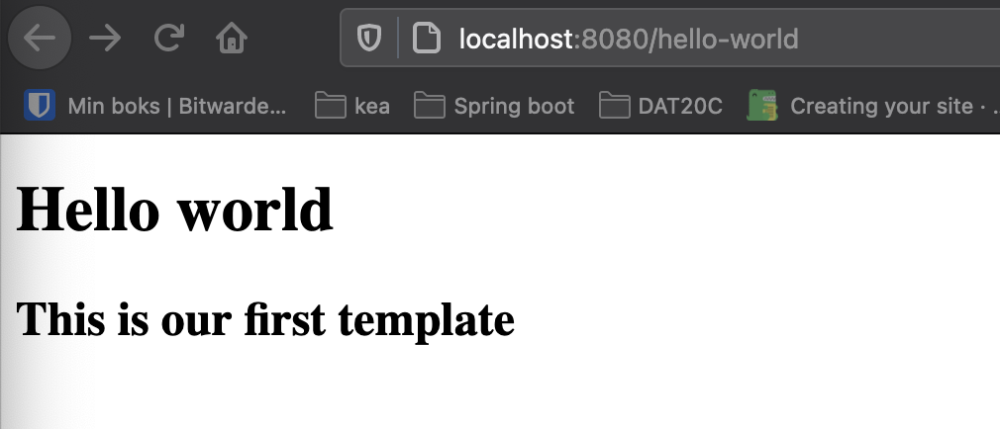

# Thymeleaf

Why are we even talking about thymeleaf?

Writing html directly in `Java` is very bad practice. Its also just not a pleasant experience. Like look at this:

```java
public String signUp() {
    return "<form action=\"/sign-up\" method=\"POST\">\n" +
            "            <input name=\"name\" placeholder=\"Put in your name\" type=\"text\">\n" +
            "            <input name=\"age\" placeholder=\"Put in your age\" type=\"text\">\n" +
            "            <button>Create new user</button>\n" +
            "        </form>";
}
```

Yikes...

---

When writing code its always good to seperate things out. We saw this with `html`, `css` and `js` aswell. Dont write css in your html, dont write js in your html and so forth. One of many reasons for this is that as a developer it can be hard to fx fix a problem if things are not separated. Imagine you are having a styling issue but you cannot find the issue in the css file. Now you have to look through html files aswell. This can be a huge pain in the a**. 

The same goes for Springboot applications! If we have a problem with some html, we expect to be able to fix that problem in an html file, not in some  `java` class!

This is where Thymeleaf comes in, it helps us with working in html files even though we have a java application!


## Overview

- Understand what Thymeleaf does and why we use it
- Writing your first template
- Accessing data in templates
- Rendering list in ThymeLeaf


## What is Thymeleaf

Thymeleaf is a templating engine. It takes care of the view part of MVC (Model, View, Controller). In our case the view willl always be rendered in html. So it will serverside render our html.

- Thymeleaf helps us work with html files even though we are working in a java application
- It also helps us send data from the controller into the view (the hmtl file)

There are other templating engines out there, but Thymeleaf is well supported and documented and seems to be the main templating engine.


### Installing Thymeleaf

Then initializing your new project, add the `spring-boot-starter-thymeleaf` using the Spring Initializr.


## Writing your first template

To create your first template, lets first create a simple hello-world example:


**Controller**

First lets create the controller. This controller handles the request that comes to `/hello-world`.

To return a template, return the name of the template as a string. Remember to not have a 

```java
@GetMapping(value = "hello-world")
public String renderHelloWorld() {
    return "hello-world.html";
}
```


**View**

To get a template to work, save the template under the location  `src/main/resources/templates`

The template below is called `src/main/resources/templates/hello-world.html`

```html
<!DOCTYPE html>
<html lang="en" xmlns:th="http://www.thymeleaf.org">
  <head>
      <title>Hello world</title>
  </head>
  <body>
      <main>
          <h1>Hello world</h1>
          <h2>This is our first template</h2>
      </main>
  </body>
</html>
```

`<!DOCTYPE html>`  tells the browser which version of html we will be using

There is one thing here that is different from a regular html file: ` xmlns:th="http://www.thymeleaf.org"`

This line prevents our IDE from complaining about the lack of a namespace definition for all those `th:*` attributes that we will be seeing in a second. 





You can also create folders in the `templates` folder. Then in the controller you just also add the folder to the return fx `return products/product-header.html`


## Accessing data

Now we have created a simple example that renders some html. But what if we wanted to send some data from the controller into the view. What we will be looking at now:


We send data to the template using the `Model` class. 


* https://www.thymeleaf.org/doc/articles/springmvcaccessdata.html     
* https://springframework.guru/displaying-list-of-objects-in-table-using-thymeleaf/